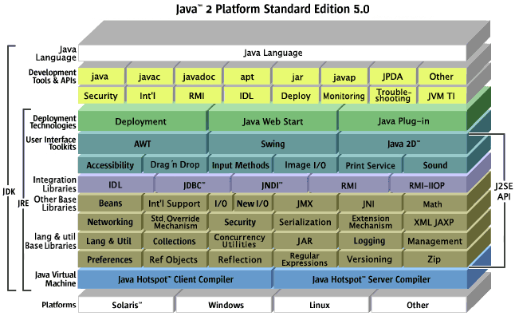

# java-basic
这里是 Java 知识点的笔记仓库。那么会记录些什么呢？

## 什么是Java?
Java 是由Sun Microsystems公司于1995年5月推出的高级程序设计语言。Java 以连续多年是最流行的后端编程语言，并且目前仍然是最受欢迎的。

   
图：一张很经典的 java 组织架构图

## Java 集合框架

什么是集合框架?摘录了一段官方的说明：

A collections framework is a unified architecture for representing and manipulating collections. All collections frameworks contain the following:

* Interfaces: These are abstract data types that represent collections. Interfaces allow collections to be manipulated independently of the details of their representation. In object-oriented languages, interfaces generally form a hierarchy.
* Implementations: These are the concrete implementations of the collection interfaces. In essence, they are reusable data structures.
* Algorithms: These are the methods that perform useful computations, such as searching and sorting, on objects that implement collection interfaces. The algorithms are said to be polymorphic: that is, the same method can be used on many different implementations of the appropriate collection interface. In essence, algorithms are reusable functionality.

集合框架资料： 
* [集合框架 API](https://docs.oracle.com/javase/8/docs/technotes/guides/collections/index.html)    
* [集合框架文档](https://docs.oracle.com/javase/tutorial/collections/intro/index.html)    

## Java8
Java 8 是当前的主流版本，也是继 Java 6 之后相对稳定的一个版本。Java8 增加了很多使用且能提高性能的功能，比如说流、Lambda 表达式。实际上，Java8 在 Java7 的基础上作了很大的改变，不但增加了很多新特性，而且对现有的代码也作了很多改进，另外，编程风格也完全不同了。

Stream.collect 是一个终端操作,它接收的参数是将流中的元素累积到汇总结果的各种方式，称为收集器。

|方法|返回类型|说明|示例|
|-------|----|---------|----------------|
|toList|List<T>|把流中所有元素收集到List中|```java \n List<Menu> menus=Menu.getMenus.stream().collect(Collectors.toList())```|
